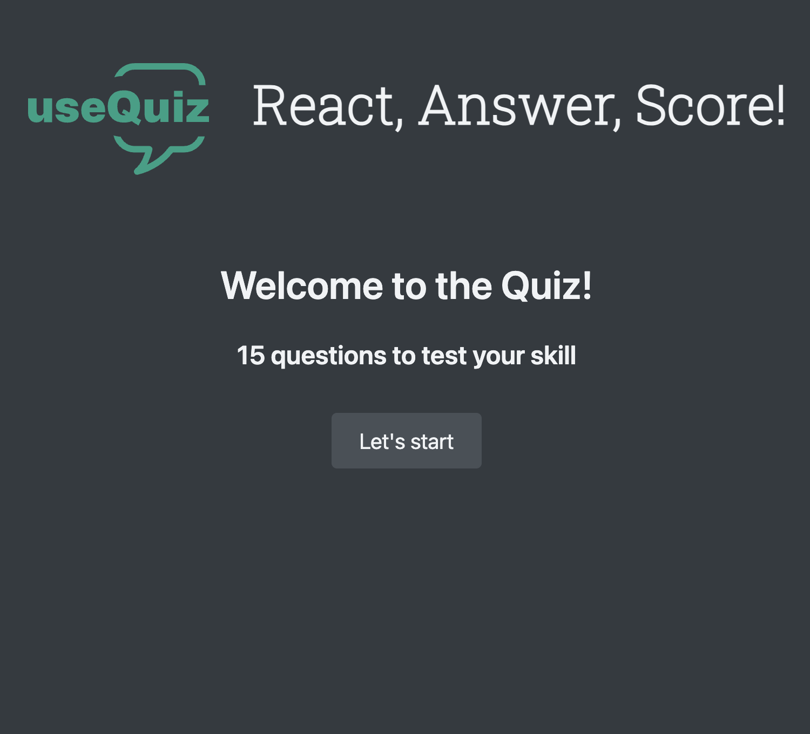
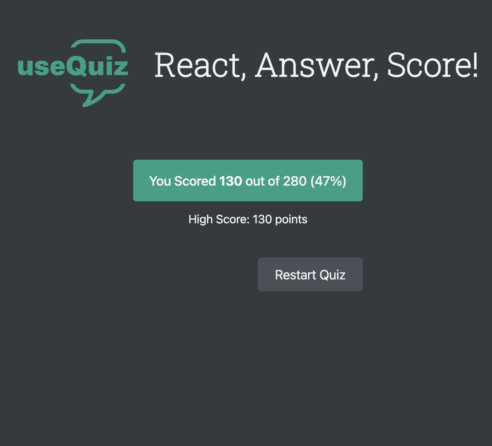

# 🎯 useQuiz – A React Quiz App

useQuiz is a fast and interactive quiz application built with **React, TypeScript, and Vite**. It features a dynamic quiz experience with a timer, progress tracking, and scoring system.Challenge yourself with timed questions and track your score!

## 🖼️ Screenshots

### 📌 Home Screen

### 📌 Quiz in Progress

### 📌 Quiz is Finished

## 🚀 Features

- ✅ Fetches and displays quiz questions dynamically
- ✅ Tracks progress and calculates scores
- ✅ Timer for added challenge
- ✅ State management using **useReducer**
- ✅ Built with **Vite** for fast performance

## 🛠️ Tech Stack

- ⚛️ **React** – Component-based UI with Hooks
- 🟦 **TypeScript** – Strongly-typed JavaScript
- ⚡ **Vite** – Fast development & build tool
- 🎨 **Pure CSS** – Simple styling
- 📡 **JSON Server** – Simulated backend for questions

## 🎬 Live Demo

🔗 [Try useQuiz Now!](https:/usequiz-emadabaei.netlify.app)

## 🧪 Testing

Tests are not implemented yet, but they will be added soon using **Vitest** and **React Testing Library** to ensure reliability and maintainability.

## 📂 Setup & Installation

1️⃣ Clone the repository:
git clone https://github.com/emad-abaei/useQuiz.git

2️⃣ Navigate to the project directory:
cd useQuiz

3️⃣ Install dependencies:
npm install

4️⃣ Start the json server:
npm run server

5️⃣ Start the development server:
npm run dev

## 🙌 Credits

This project was originally inspired by a course from **Jonas Schmedtmann**. While the core idea comes from the course, I have made several enhancements, including:

- **Migrating from JavaScript to TypeScript** for better type safety and maintainability.
- **Implementing a mobile-friendly design** to improve responsiveness on smaller screens.
- **Refactoring and optimizing the codebase** for cleaner, more efficient development.

These improvements make **useQuiz** a more robust and scalable movie search and watchlist application.

## 🏆 Contributing

Contributions are welcome! Feel free to submit issues or pull requests.

## 📜 License

This project is licensed under the MIT License.
